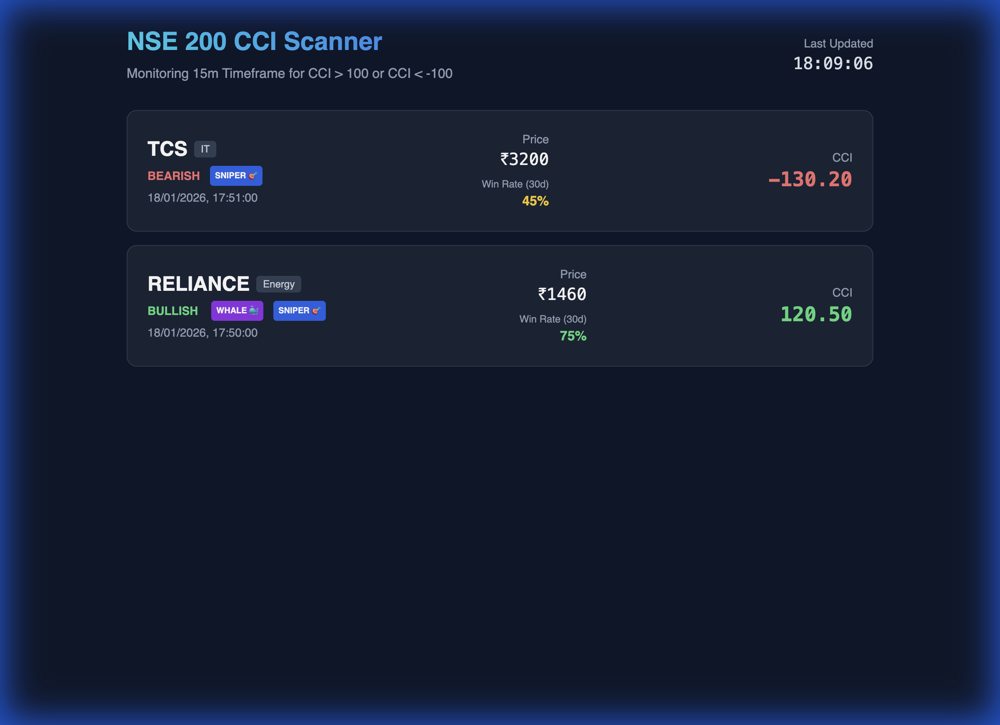

# NSE 200 Trading Scanner & Algorithmic Platform 📈

A high-performance web application that scans NSE 200 stocks in real-time for CCI (Commodity Channel Index) crossovers. It identifies Bullish (>100) and Bearish (<-100) signals on a 15-minute timeframe and provides advanced institutional-grade filters.



## 🚀 Key Features

### Core Logic
- **Real-time Monitoring**: Scans all NSE 200 stocks every 5 minutes.
- **CCI Strategy**: Triggers alerts when CCI crosses +100 (Buy) or -100 (Sell).
- **Email Alerts**: Instant email notifications with detailed signal analysis.

### 🧠 Advanced "Hedge Fund" Filters
This platform goes beyond simple indicators by adding probabilistic layers:

1.  **WHALE 🐳 Filter (Smart Money)**
    *   Detects if the signal candle has **Volume > 200%** of the 20-period average.
    *   *Why?* Helps distinguish institutional buying from retail noise.

2.  **SNIPER 🎯 Filter (Trend Alignment)**
    *   Checks the **Daily Chart** trend before alerting on the 15m chart.
    *   *Logic*: Only buys if Price > 200 EMA on Day chart (Trend Following).

3.  **INSTANT TRUTH (Backtesting)**
    *   Calculates the **Win Rate** of this specific signal for this stock over the last 30 days.
    *   *Example*: "RELIANCE Buy Signal: 75% Win Rate (15/20 trades)".

4.  **Sector Heatmap**
    *   Identifies the sector (e.g., IT, Energy, Bank) to help correlate with broader market moves.

## 🛠️ Tech Stack
- **Backend**: Python (FastAPI)
- **Data Fetching**: Direct Yahoo Finance API (Robust & Free)
- **Frontend**: React.js (CDN-based, No-Build) + TailwindCSS
- **Database**: In-memory (Pandas DataFrame) for speed
- **Deployment**: Ready for Render / Railway / Heroku

## ⚙️ Installation & Local Setup

1.  **Clone the repository**
    ```bash
    git clone https://github.com/Aniruddh-11-stack/nse-trading-platform.git
    cd nse-trading-platform
    ```

2.  **Create a Virtual Environment**
    ```bash
    python3 -m venv venv
    source venv/bin/activate  # Windows: venv\Scripts\activate
    ```

3.  **Install Dependencies**
    ```bash
    pip install -r backend/requirements.txt
    ```

4.  **Configure Environment**
    Create a `.env` file in the root directory:
    ```env
    EMAIL_USER=your_email@gmail.com
    EMAIL_PASS=your_app_password
    ALERT_EMAIL=recipient_email@gmail.com
    SMTP_SERVER=smtp.gmail.com
    SMTP_PORT=587
    ```

5.  **Run the App**
    ```bash
    uvicorn backend.main:app --reload
    ```
    Access the dashboard at `http://localhost:8000`.

## ☁️ Deployment

This project is configured for seamless deployment on **Render**.
See [deployment_guide.md](deployment_guide.md) for step-by-step instructions.

## 🤝 Contributing
Built by **Aniruddh-11-stack**. Feel free to fork and submit PRs!
